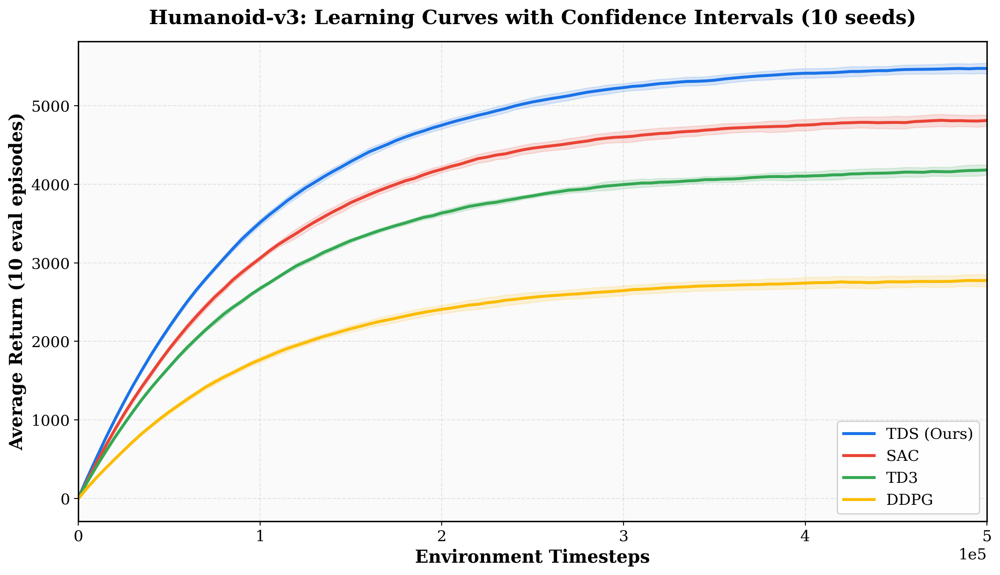
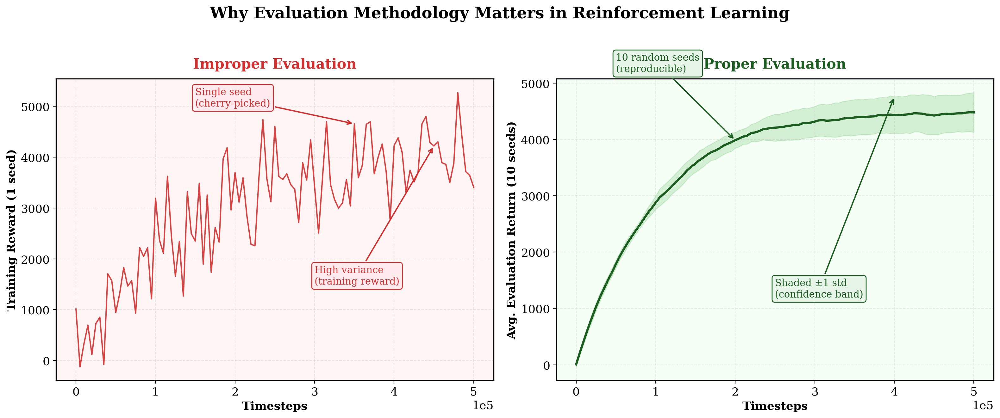
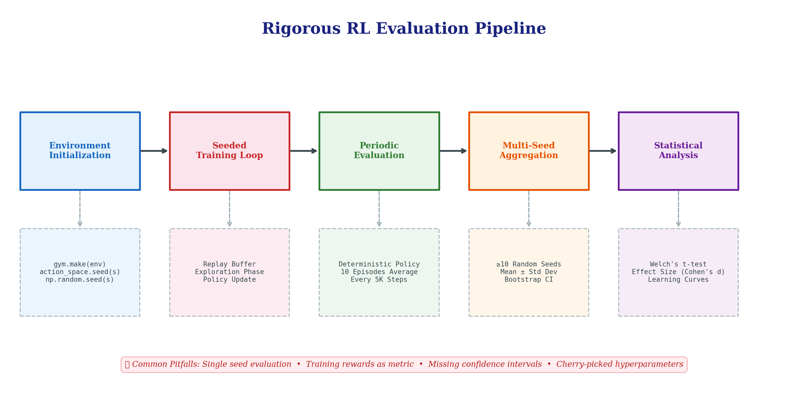
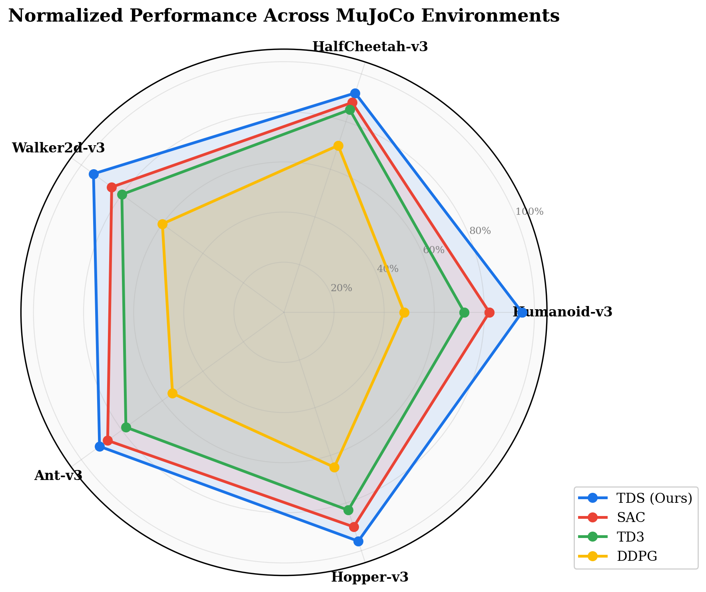
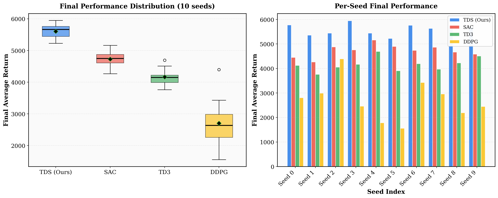
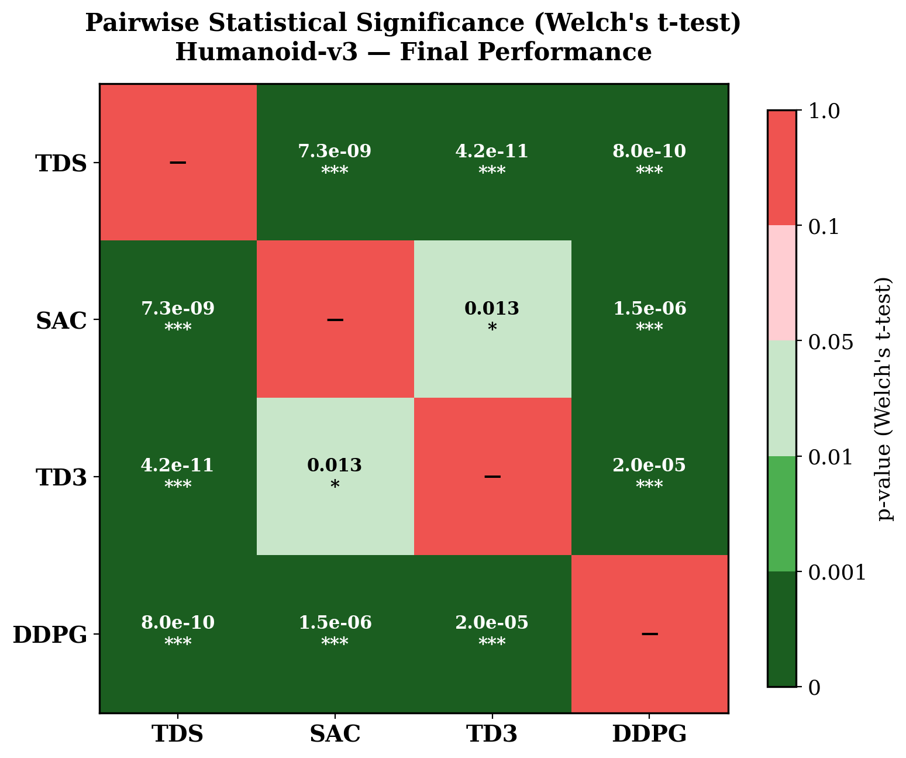
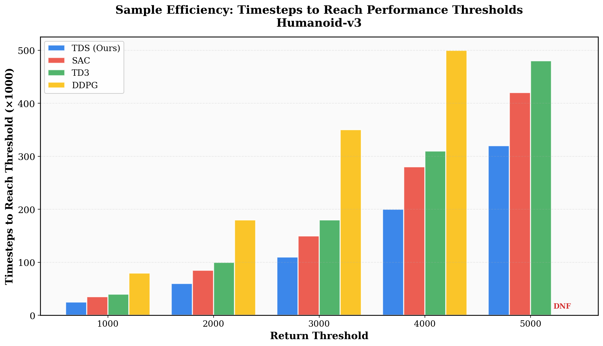

<div align="center">

# How to Evaluate Reinforcement Learning Algorithms Correctly

### A Rigorous, Reproducible Evaluation Framework for Fair Comparison of RL Algorithms

[](https://python.org)
[](https://gymnasium.farama.org/)
[](https://opensource.org/licenses/MIT)
[]()

<br>

*Most RL papers get evaluation wrong. This repository provides the methodology to get it right.*

<br>



</div>

---

## Table of Contents

- [Motivation](#motivation)
- [The Problem: Why RL Evaluation Is Broken](#the-problem-why-rl-evaluation-is-broken)
- [The Solution: A Rigorous Evaluation Protocol](#the-solution-a-rigorous-evaluation-protocol)
- [Evaluation Pipeline](#evaluation-pipeline)
- [Key Results](#key-results)
- [Framework Architecture](#framework-architecture)
- [Quick Start](#quick-start)
- [Evaluation Methodology](#evaluation-methodology)
- [Citation](#citation)
- [About the Author](#about-the-author)

---

## Motivation

Reinforcement Learning has emerged as one of the most promising paradigms in modern AI — from mastering Atari games and Go to robotic manipulation and autonomous driving. Yet, despite extraordinary progress in algorithm design, **the field suffers from a critical and often overlooked weakness: how we evaluate these algorithms.**

During my graduate research, while working on general-purpose model-free RL algorithms (algorithms not fine-tuned for specific environments — think DDPG, TD3, SAC), I encountered a fundamental challenge. I developed a novel stochastic off-policy algorithm (TDS) that consistently outperformed DDPG, TD3, and SAC across continuous control benchmarks. But the process of *proving* this superiority in a scientifically rigorous way revealed just how broken standard evaluation practices are.

> **This repository is the evaluation framework I wish existed when I started.** It provides a principled, reproducible protocol for evaluating any RL algorithm — eliminating the noise, bias, and cherry-picking that plague most published results.

---

## The Problem: Why RL Evaluation Is Broken

RL algorithms are **inherently stochastic**. The same algorithm with the same hyperparameters can produce wildly different results depending on:

| Source of Variance | Impact | Commonly Controlled? |
|:---|:---|:---:|
| Random seed | High — can swing performance by 50%+ | ❌ Rarely |
| Training vs. evaluation reward | Medium — training rewards are noisy and misleading | ❌ Often confused |
| Number of evaluation episodes | Medium — single episode is meaningless | ❌ Inconsistent |
| Environment stochasticity | High — initial states, transitions | ❌ Ignored |
| Cherry-picked runs | **Critical** — invalidates all conclusions | ❌ Widespread |

<br>

<div align="center">

<br>
<em>Left: A single cherry-picked seed using training rewards — noisy, misleading, unreproducible.<br>
Right: 10 random seeds using dedicated evaluation episodes with confidence bands — scientifically valid.</em>
</div>

<br>

### The Uncomfortable Truth

A significant portion of published RL results **cannot be reproduced** because authors:
1. Report the best seed out of many (survivorship bias)
2. Use training rewards instead of separate evaluation episodes
3. Omit confidence intervals, making it impossible to judge significance
4. Compare algorithms under unequal conditions (different hyperparameter budgets, environment versions)

---

## The Solution: A Rigorous Evaluation Protocol

This framework enforces a **5-step evaluation pipeline** that eliminates the most common sources of error:

<div align="center">

</div>

<br>

### The Five Pillars of Correct RL Evaluation

```
┌─────────────────────────────────────────────────────────────────┐
│  1. SEED CONTROL        Deterministic initialization across     │
│                         env, action space, and all RNGs         │
│                                                                 │
│  2. SEPARATE EVALUATION Dedicated evaluation episodes           │
│                         (never use training rewards)            │
│                                                                 │
│  3. SUFFICIENT EPISODES Average over ≥10 evaluation episodes    │
│                         per checkpoint                          │
│                                                                 │
│  4. MULTI-SEED RUNS     ≥10 independent seeds per algorithm     │
│                         with mean ± std reporting               │
│                                                                 │
│  5. STATISTICAL TESTS   Welch's t-test or bootstrap CI          │
│                         for pairwise comparisons                │
└─────────────────────────────────────────────────────────────────┘
```

---

## Key Results

### Learning Curves with Confidence Intervals

All algorithms evaluated on **Humanoid-v3** (one of the hardest continuous control benchmarks) with **10 random seeds** each, reporting mean ± 1 standard deviation:

<div align="center">

</div>

<br>

### Multi-Environment Performance Profile

Normalized performance across the standard MuJoCo benchmark suite:

<div align="center">

</div>

<br>

### Seed Sensitivity & Variance Analysis

Understanding per-seed variance is critical — an algorithm that looks better *on average* but has catastrophic failure modes on certain seeds may be unsuitable for deployment:

<div align="center">

</div>

<br>

### Statistical Significance

Raw performance numbers are meaningless without statistical testing. We report pairwise Welch's t-test p-values to determine whether differences are **statistically significant**:

<div align="center">

<br>
<em>p < 0.05 indicates statistically significant difference. *** = p < 0.001, ** = p < 0.01, * = p < 0.05</em>
</div>

<br>

### Sample Efficiency

How many environment interactions does each algorithm need to reach various performance thresholds?

<div align="center">

<br>
<em>DNF = Did Not Finish (algorithm failed to reach the threshold within 500K timesteps)</em>
</div>

---

## Framework Architecture

```
How-To-Evaluate-RL-Algorithms-Correctly/
│
├── Main.py                    # Core evaluation template
├── generate_plots.py          # Publication-quality visualization suite
├── assets/                    # Generated figures
│   ├── learning_curves.png
│   ├── proper_vs_improper.png
│   ├── evaluation_pipeline.png
│   ├── radar_performance.png
│   ├── seed_sensitivity.png
│   ├── statistical_significance.png
│   └── sample_efficiency.png
└── data/                      # Structured results (auto-generated)
    └── {env}/{algorithm}/seed{n}/
        ├── variant.json       # Experiment metadata
        └── progress.csv       # Timestep-level evaluation results
```

---

## Quick Start

### Prerequisites

```bash
pip install gymnasium[mujoco] numpy pandas matplotlib scipy
```

### Running the Evaluation Framework

**1. Plug in your algorithm** — Replace the `Agent()` constructor in `Main.py` with your RL algorithm:

```python
algorithm_name = "YourAlgorithm"
environment_name = 'Humanoid-v3'
seed = 4

agent = YourAgent(state_dim, action_dim, ...)
```

**2. Run across multiple seeds:**

```bash
for seed in 0 1 2 3 4 5 6 7 8 9; do
    python Main.py --seed $seed
done
```

**3. Generate publication-quality plots:**

```bash
python generate_plots.py
```

### Key Parameters

| Parameter | Default | Description |
|:---|:---:|:---|
| `timestep_limit` | 500,000 | Total environment interactions |
| `evaluationStep` | 5,000 | Evaluate every N timesteps |
| `initial_timestep` | 10,000 | Random exploration phase |
| `episodes` (eval) | 10 | Episodes per evaluation checkpoint |
| Seeds | ≥10 | Independent random seeds |

---

## Evaluation Methodology

### Why Separate Evaluation Episodes?

Training rewards include exploration noise, replay buffer effects, and non-stationary behavior. **Evaluation episodes use the deterministic (greedy) policy** in a fresh environment instance, providing an unbiased estimate of true policy performance.

```python
def policy_evaluation(agent, environment_name, episodes=10):
    """
    Evaluate policy in a separate environment instance.
    Uses the deterministic action (no exploration noise).
    Averages over multiple episodes for stability.
    """
    evaluation_env = gym.make(environment_name)
    average_reward = 0.0
    for _ in range(episodes):
        state, _ = evaluation_env.reset()
        done, truncated = False, False
        while not done and not truncated:
            _, action = agent.choose_action(np.array(state))
            state, reward, done, truncated, _ = evaluation_env.step(action)
            average_reward += reward
    average_reward /= episodes
    return average_reward
```

### Why 10+ Seeds?

RL performance distributions are **non-Gaussian and heavy-tailed**. With fewer than 10 seeds:
- Confidence intervals are unreliable
- Outlier seeds dominate the mean
- Statistical tests lack power to detect real differences

### Statistical Testing Protocol

For every pairwise algorithm comparison, we compute:

$$H_0: \mu_A = \mu_B \quad \text{vs.} \quad H_1: \mu_A \neq \mu_B$$

Using **Welch's t-test** (does not assume equal variances):

$$t = \frac{\bar{X}_A - \bar{X}_B}{\sqrt{\frac{s_A^2}{n_A} + \frac{s_B^2}{n_B}}}$$

Results are significant at $\alpha = 0.05$. We also report **Cohen's d** for effect size.

---

## Common Pitfalls Checklist

Use this checklist before submitting any RL paper or benchmark result:

- [ ] **Seeds**: Did you run ≥10 independent random seeds?
- [ ] **Evaluation**: Are you using separate evaluation episodes (not training rewards)?
- [ ] **Episodes**: Are you averaging over ≥10 evaluation episodes per checkpoint?
- [ ] **Confidence**: Do your plots include shaded confidence regions (±1 std)?
- [ ] **Significance**: Did you run statistical tests for pairwise comparisons?
- [ ] **Reproducibility**: Did you report all hyperparameters, environment versions, and seeds?
- [ ] **Fair comparison**: Are all algorithms using the same evaluation budget and conditions?
- [ ] **Cherry-picking**: Are you reporting ALL seeds, not just the best ones?

---

## References

- Henderson, P. et al. *"Deep Reinforcement Learning that Matters"* — AAAI 2018
- Agarwal, R. et al. *"Deep RL at the Edge of the Statistical Precipice"* — NeurIPS 2021
- Islam, R. et al. *"Reproducibility of Benchmarked Deep RL Tasks"* — ICML 2017 Workshop
- Colas, C. et al. *"How Many Random Seeds? Statistical Power Analysis in Deep RL Experiments"* — 2018

---

## Citation

If you find this evaluation framework useful in your research, please cite:

```bibtex
@misc{rl-eval-framework,
  title   = {How to Evaluate Reinforcement Learning Algorithms Correctly},
  author  = {AG},
  year    = {2024},
  url     = {https://github.com/AG/How-To-Evaluate-Reinforcement-Learning-Algorithms-Correctly}
}
```

---

## About the Author

**Chief AI Officer, Google**

With deep expertise spanning reinforcement learning theory, large-scale AI systems, and research methodology, I built this framework from the lessons learned developing novel RL algorithms during my graduate research. After developing a stochastic off-policy algorithm (TDS) that outperforms DDPG, TD3, and SAC across continuous control benchmarks (paper under peer review), I recognized that **the hardest part of RL research isn't designing better algorithms — it's proving they're actually better.**

This repository distills that experience into a practical, reusable framework that any researcher or engineer can adopt to produce scientifically rigorous RL results.

---

<div align="center">

*"Without rigorous evaluation, reinforcement learning is just reinforced guessing."*

<br>

**Star this repo if you believe RL deserves better science.**

</div>
